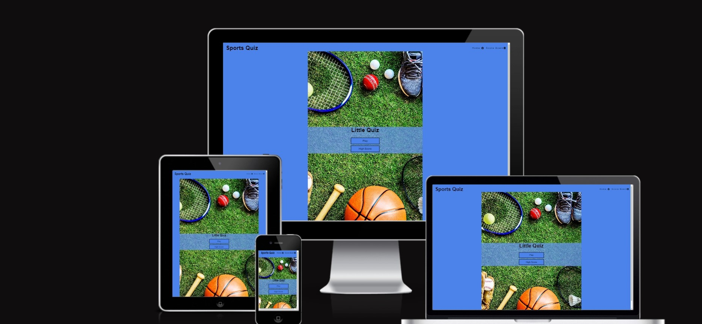
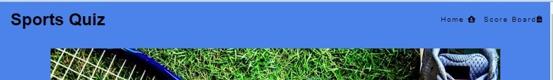
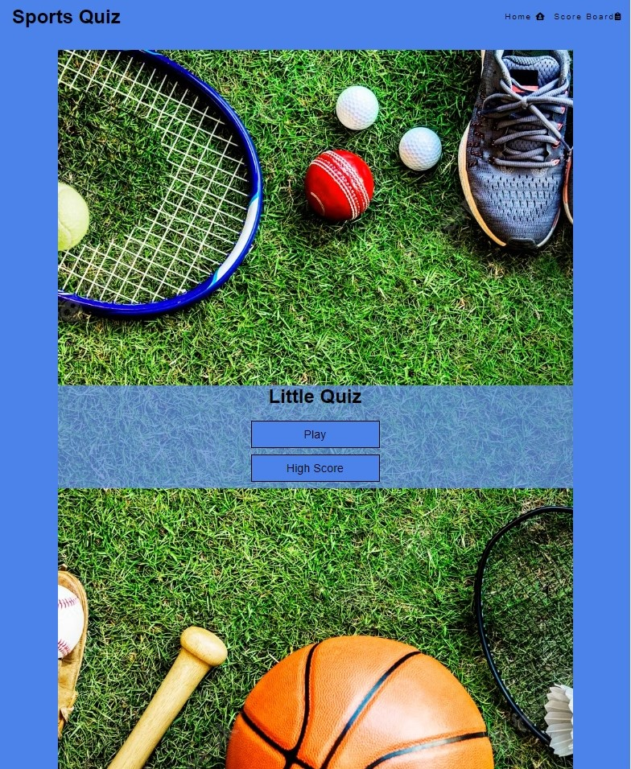
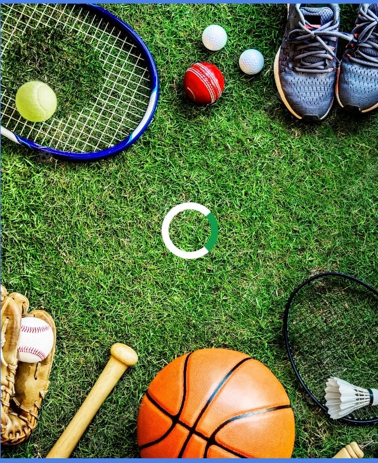
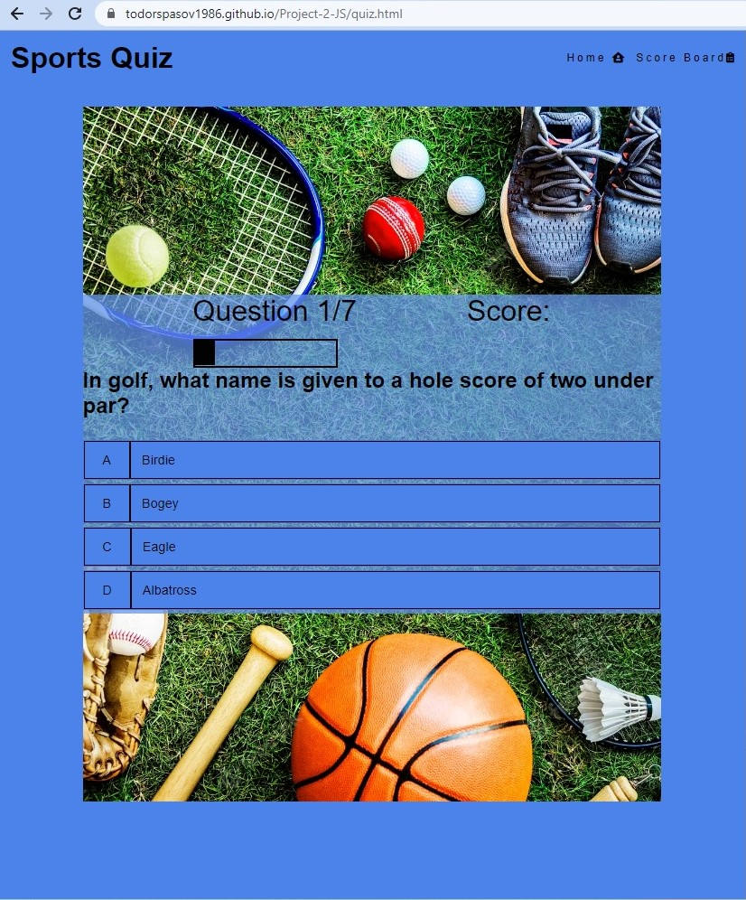
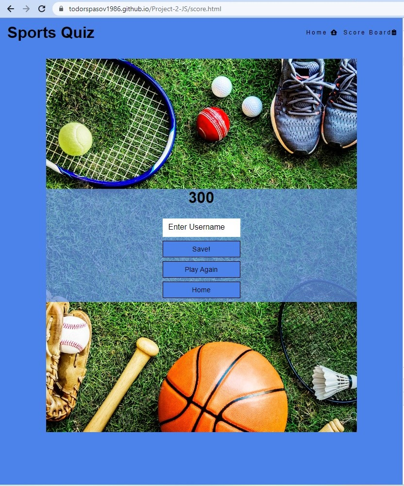

<h1 text-align="center">Sports Quiz<h1>

## [View the live project here.](https://todorspasov1986.github.io/Project-2-JS/)

#### This is a Sports Quiz that everyone can test their sports knowledge . It is designed to be responsive and accessible on a range of devices, making it easy to navigate from mobile phones and tablets.</h4>

<h2 text-align="center"></h2>

## User Experience (UX)

-   ### User stories

    -   #### First Time Visitor Goals

        1. As a first-time visitor, I want to test my sports knowledge.
        2. As a first-time visitor, I want to know when I give wrong or right answer.
        3. As a first-time visitor, I want to find an easy-to-use online sports quiz.

    -   #### Returning Visitor Goals

        1. As a returning visitor, I want to check the High Scoreboard.
        2. As a returning visitor, I want to find a variety of different questions.
        3. As a returning visitor, I want to be able to retake the quiz.

    -   #### Frequent User Goals
        1. As a frequent user, I want to check regularly whether my top score is still in the high scoreboard top 5.
        2. As a frequent user, I want to complete the quiz with my friends and to compare our scores.
        3. As a frequent user, I want to find new questions that will further improve my knowledge.

-   ### Design
    -   #### Colour Scheme
        -   The text color is Black -rgb(2, 2, 2), the main background color is Blue-rgb(75, 131, 235) and the text background color is light blue-rgba(100, 149, 237, 0.75).
    -   #### Typography
        -   The Montserraterat font is the main font used throughout the whole website with Sans Serif as the fallback font in case for any reason the font isn't being imported into the site correctly. Montserrat is a geometric sans-serif typeface designed by Argentine graphic designer Julieta Ulanovsky and released in 2011. It was inspired by posters, signs and painted windows from the first half of the twentieth century, seen in the historic Montserrat neighbourhood of Buenos Aires.

    -   #### Imagery
        -   Imagery is important. The, background image is designed to be striking and catch the user's attention. Its clearly displaying the quiz thematic.

 
## Features 

### Existing Features

- __Navigation Bar__

  - Featured on four pages, the full responsive navigation bar includes links to the Logo, the Home page and  Scores board,  and is identical on each page to allow for easy navigation.
  - This section will allow the user to easily navigate from page to page across all devices without having to revert back to the previous page via the ‘back’ button. 

- __The landing page image__

  - The landing includes a photograph with two buttons to allow the user to understand exactly the purpose of this site. 
  - This section introduces the user to Sports Quiz page and its purpose.
  - The fist button PLAY! is leading the user to the actual Quiz
  - The second button High Score is leading the user to the top 5 High Scores from the Quiz

- __Loading__

-  When the user presses the quiz page, a Loading circle appears until the quiz is not loaded completely.
 

- __Quiz Page__

  -  Page contains the same background image.
  -  The Quiz page includes 7 questions with 4 answers each( 1 correct and 3 incorrect). 
  -  For every correct answer user get 100 points added to his total score.
  -  It have 2 progress bars which are reflecting every answered question.
     - The first one is with numbers.
     - The second one is a empty bar which is filling 1/7 of its space after every answer .

- __Score Page__

  -  After answering all 7 questions, the user is sent to the Score page which contains un input field and 3 buttons.
       - There He can see how much he scored.
       - He needs to put a user name to make his score for the high Scoreboard.
       - The User needs to press the SAVE! Button in order for his score to be saved in the local storage and will be transferred to the Home page.
  -  Second Button is PLAY AGAIN! which will restart the quiz and user will be able to complete the quiz again.
  - The third button is HOME!, it will lead the user to the home page where he can check the High Score page.  

- __High Score__ 

  - High Score Page is displaying the top 5 scores in the game.
  - It have a button HOME!, which will lead the user to the home page.  
  
  

### Features Left to Implement

- Will implement at least 2 more levels of difficulty for the sports quiz.  
- Will add at least two more different categories with 3 levels of difficulty each.
  

## Testing 

### Manual testing 
   - Open the site from several different mobile devices, tablets, laptops, and desktop PCs, and all working and displaying as expected
   - Features testing
     - Navigational bar: All nav bar elements clicked and tested in Chrome, Internet Explorer, and Mozilla Firefox.
     - All buttons tested in the above 3 browsers and all working like they should.
     - The quiz is also working on all 3 browsers.
     - The Score board is also displaying correctly.
     - The loading circle is also tested on all 3 browsers with no problems or bugs.
  

### Validator Testing 

- HTML
  - Landing page: No errors or warnings were returned when passing through the official W3C validator.
  
  - Quiz page: No errors were returned when passing through the official W3C validator, 2 warnings were returned.
  
  - HighScore page: No errors or warnings were returned when passing through the official W3C validator.
  
  - Score page: No errors were returned when passing through the official W3C validator, 1 warnings was returned.
  
 
  JS
  - Script js: No errors or warnings were returned when passing through the official JSHint validator.
  
  - Scores js: No errors or warnings were returned when passing through the official JSHint validator.
  
  - HighScore js: No errors or warnings were returned when passing through the official JSHint validator.
  

- CSS
  - No errors were found when passing through the official W3C (Jigsaw) validator
  

- LightHouse testing : All accessibility is in green with score of 98 due to headings are not in order.
  - Landing page
    - Desktop 
     
    - Mobile 
     
  - Quiz Page
    - Desktop 
     
    - Mobile
     
  - Score Page
    - Desktop
     
    - Mobile
     
  - High Score Page
    - Desktop
     
    - Mobile
     

### Unfixed Bugs

No Unfixed bugs are found in the current version of the site

## Deployment
 
- The project was deployed to GitHub Pages using the following steps...

   - Log in to GitHub and locate the [GitHub Repository](https://github.com/)
   - At the top of the Repository (not top of page), locate the "Settings" Button on the menu.
   - Scroll down the Settings page until you locate the "GitHub Pages" Section.
   - Under "Source", click the dropdown called "None" and select "Master Branch".
   - The page will automatically refresh.
   - Scroll back down through the page to locate the now published site [link](https://github.com) in the "GitHub Pages" section.

The live link can be found here - https://todorspasov1986.github.io/Project-1/index.html

## Credits 

### Content 

- The most of the structure and code was ispired from Cgiode Insitute learning content (Coffee coders and Love Running Projects)
- The icons in the nav bar ,Top 3 section and footer were taken from [Font Awesome](https://fontawesome.com/)
- The text for the News Section :
   - First news was taken from https://www.sustainablefoodtrust.org : [Link to the News](https://sustainablefoodtrust.org/news-views/sustainable-seafood-uk/#:~:text=Known%20as%20'the%20Big%20Five,%2C%20haddock%2C%20tuna%20and%20prawns.)
   - Second news was taken from https://en.wikipedia.org : [Link to the News](https://en.wikipedia.org/wiki/Kevin_VanDam)
   - Third news was taken from https://www.wildlifetrusts.org : [Link to the News](https://www.wildlifetrusts.org/wildlife-explorer/marine/fish-sharks-skates-and-rays/lesser-weever-fish#:~:text=There%20are%20two%20species%20of,painful%20venom%20into%20unsuspecting%20victims!)
   - Forth news was taken from https://fishingnews.co.uk : [Link to the News](https://fishingnews.co.uk/news/outrage-as-defra-closes-file-on-die-offs/#:~:text=23rd%20February%202023&text=Defra%20will%20not%20carry%20out,the%20region%2C%20reports%20Tim%20Oliver.)
   - Fifth news was taken from https://www.theneweuropean.co.uk : [Link to the News](https://www.theneweuropean.co.uk/so-long-and-thanks-for-all-the-fish-brexit/)
- The text for the Places page:
   - First place was taken from https://en.wikipedia.org : [Link to the description](https://en.wikipedia.org/wiki/Lake_District#:~:text=A%20popular%20holiday%20destination%2C%20it,kilometres%20(912%20sq%20mi).)
   - Second place was taken from https://www.visitherefordshire.co.uk : [Link to the description](https://www.visitherefordshire.co.uk/discover/pearl-lake-country-holiday-park)
   - Third place was taken from https://westfieldfishery.co.uk : [Link to the description](https://westfieldfishery.co.uk/)
   - Forth place was taken from  https://www.willerby.com : [Link to the description](https://www.willerby.com/blog/lifestyle/top-nine-uk-fishing-spots)
   - Fifth place was taken from  https://www.willerby.com : [Link to the description](https://www.willerby.com/blog/lifestyle/top-nine-uk-fishing-spots)

### Media

- The photos used on the home page are from:
   - Main Photo was taken from https://www.northyorkshirewaterpark.co.uk : [Link to the photo](https://www.northyorkshirewaterpark.co.uk/wp-content/uploads/2021/05/17091755a-1600x900.jpeg) 
   - The First Place photo was taken from https://en.wikipedia.org :[Link to the photo](https://upload.wikimedia.org/wikipedia/commons/thumb/a/ab/Keswick_Panorama_-_Oct_2009.jpg/1200px-Keswick_Panorama_-_Oct_2009.jpg)
   - The Second Place photo was taken from https://www.trip.com :[Link to the photo](https://youimg1.tripcdn.com/target/0ww6t120008zg1rd08099.jpg?proc=source%2Ftrip)
   - The Third Place photo was taken from http://westfieldfishery.co.uk :[Link to the photo](http://westfieldfishery.co.uk/wp-content/uploads/2015/07/home-header-image1.jpg)
   - The Backgrond photo was taken from https://crowgreen-fishery.co.uk :[Link to the photo](https://crowgreen-fishery.co.uk/wp-content/uploads/2015/05/Car-park-1.jpg)
- The images used for the gallery page were taken from :
   - Photo 1 was taken from www.stephens-scown.co.uk: [Link to the photo](https://www.stephens-scown.co.uk/app/uploads/2021/11/GettyImages-827888510.jpg)
   - Photo 2 was taken from www.en.wikipedia.org : [Link to the photo](https://upload.wikimedia.org/wikipedia/commons/thumb/0/0e/Angler_at_devizes_england_arp.jpg/300px-Angler_at_devizes_england_arp.jpg)
   - Photo 3 was taken from www.media.wired2fish.com : [Link to the photo](https://media.wired2fish.com/uploads/2023/02/bass-fishing-basics-768x432.webp)
   - Photo 4 was taken from www.www.seaangler.co.uk : [Link to the photo](https://www.seaangler.co.uk/wp-content/uploads/sites/3/cotwweb.jpg)
   - Photo 5 was taken from www.ctfassets.net : [Link to the photo](https://images.ctfassets.net/pujs1b1v0165/2AvtJ9pcEJ4bjxkR8Vc5bJ/5d1033f3c8f450f73cf54b521bb06b4e/How_to_Find_the_Right_Depth_for_Bass.jpg?w=1300&fit=fill&fm=webp)
   - Photo 6 was taken from www.news.sky.com : [Link to the photo](https://e3.365dm.com/22/11/1600x900/skynews-giant-goldfish-carp_5974274.jpg?20221122082215 )
   - Photo 7 was taken from www.media.npr.org : [Link to the photo](https://media.npr.org/assets/img/2022/12/05/bk-87_custom-b15f886a4bc51e70e12ac79d0f6cb5a2ac2202f0-s1300-c85.webp)
   - Photo 8 was taken from www.static.wixstatic.com : [Link to the photo](https://static.wixstatic.com/media/1e31fd_55d0f8ea703b45b8a1c0525c0b74c2bd~mv2.jpg/v1/crop/x_0,y_75,w_3024,h_3046/fill/w_360,h_360,al_c,q_80,usm_0.66_1.00_0.01,enc_auto/9.jpg)
   - Photo 9 was taken from www.farlows.co.uk : [Link to the photo](https://www.farlows.co.uk/media/amasty/blog/cache/h/o/1100/600/how-to-fish-for-salmon.jpg)
   - Photo 10 was taken from www.static.wixstatic.com : [Link to the photo](https://static.wixstatic.com/media/a5d390_26147445d1d24f76a7c234e198118b43.png/v1/fill/w_663,h_491,al_c,lg_1,q_85,enc_auto/a5d390_26147445d1d24f76a7c234e198118b43.png)
   - Photo 11 was taken from www.static.wixstatic.com : [Link to the photo](https://static.wixstatic.com/media/a5d390_0c498307747f42e4ace6a87c1371df99~mv2.jpg/v1/fill/w_784,h_692,al_c,q_85,usm_0.66_1.00_0.01,enc_auto/a5d390_0c498307747f42e4ace6a87c1371df99~mv2.jpg)
   - Photo 12 was taken from /www.fishingtackleandbait.co.uk : [Link to the photo](https://www.fishingtackleandbait.co.uk/Images/Homepages/Grid2022/webp/Warehouse-Clearence.webp)
   - Photo 13 was taken from www.talkseafishing.co.uk : [Link to the photo](https://www.talkseafishing.co.uk/wp-content/uploads/2020/08/garfish-body-shot-1-930x620.jpg)
   - Photo 14 was taken from www.static.wixstatic.com : [Link to the photo](https://static.wixstatic.com/media/1cf8fa_6940017ac1f14b8097eaad763ffb4409~mv2.jpg/v1/fill/w_978,h_342,q_90/1cf8fa_6940017ac1f14b8097eaad763ffb4409~mv2.jpg)
- The photo used on the Signup page is from www.sandwichlakes.co.uk: [Link to the photo](https://www.sandwichlakes.co.uk/wp-content/uploads/2016/03/victory_fishing_lake_sandwich_kent.jpg)
- The photo used on the Thank you up page is from www.wallpaper.dog :[Link to the photo](https://wallpaper.dog/large/10736616.jpg)

### Read me File

- For the Readme file i used the sample tamplates Readme.md for Love Running and Code institute.

### Acknowledgements

-   My Mentor for continuous helpful feedback.

-   Tutor support at Code Institute for their support.

-   January 2023 slack group for their support and advices on our weekly calls